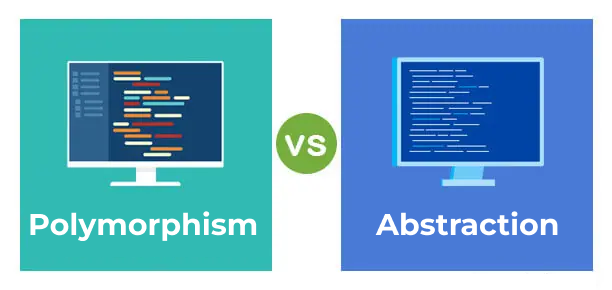

<div align="center"><h2> Abstraction and Polymorphism </h2>


</div>
<hr>

These two are among the most important characteristics of Object Oriented paradigm:

- [Abstraction](#abstraction)
- [Polymorphism](#polymorphism)
- [Conclusion](#conclusion)

## ✧ <span id='abstraction'>Abstraction</span>

Data Abstraction is the most important features of any OOPS programming language. It shows only useful information, remaining are hidden form the end user. Abstraction is the any representation of data in which the implementation details are hidden (abstracted).

```php
abstract class Animal
{
    public $name;
    public $color;

    public function __construct($name, $color)
    {
        $this->name = $name;
        $this->color = $color;
    }

    public function describe()
    {
        return $this->name . ' color is ' . $this->color;
    }

    // Abstract Method
    abstract public function makeSound();
}

class Dog extends Animal
{
    public $sound;

    public function __construct($name, $color, $sound)
    {
        parent::__construct($name, $color);
        $this->sound = $sound;
    }

    // Implement the Abstract Method
    public function makeSound()
    {
        return "The Sound $this->sound By the $this->name";
    }
}

$animal = new Animal();
$animal->name = 'Animal';
$animal->color = 'Brown';
echo $animal->describe(); // Animal color is Brown

$dog = new Dog('Dog', 'Black', 'Bark');
echo $dog->describe(); // Dog color is Black
echo $dog->makeSound(); // The Sound Bark By Dog
```

<hr>

## ✧ <span id='polymorphism'>Polymorphism</span>

Polymorphism means reuse with different types. So with my set example you could create sets of Social Security numbers, sets of full names, or sets of fruitbats, all using the same code.

```php
interface Machine
{
    public function calcTask();
}

class Circle implements Machine
{
    private $radius;
    public function __construct($radius)
    {
        $this->radius = $radius;
    }
    public function calcTask()
    {
        return $this->radius * $this->radius * pi();
    }
}

class Rectangle implements Machine
{
    private $width;
    private $height;

    public function __construct($width, $height)
    {
        $this->width = $width;
        $this->height = $height;
    }

    public function calcTask()
    {
        return $this->width * $this->height;
    }
}

$mycirc = new Circle(3);
$myrect = new Rectangle(3, 4);
echo $mycirc->calcTask(); // 28.274
echo $myrect->calcTask(); // 12
```

The interface with the name of `"Machine"` commits all the classes that implement it to define an abstract method with the name of `callTask()`.

In accordance, the `Circle` class implements the interface by defining the `callTask()` method with the respective body inside it.

The `Rectangle` class also implements the Machine interface but defines the method `callTask()` with a <b>different body</b> that differs from the circle class `callTask()` method. The polymorphism guideline says that, for this situation, all the methods that calculate the task would have the equivalent name.

<hr>

## ✧ <span id='conclusion'>In Conclusion:</span>

<b>Abstraction</b> is conceptual, <b>Polymorphism</b> is behavioral
